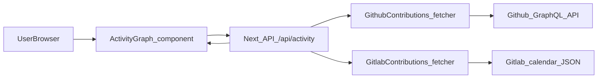

## GitHub & GitLab Activity Graph Plan

### 1. Configure environment and settings

- **Env variables**: Add the following to `.env.local` (user-created, not committed):
  - `GITHUB_USERNAME` and `GITLAB_USERNAME` for the accounts to display.
  - `GITHUB_TOKEN` (GitHub personal access token with minimal `read:user` scope; no special scopes needed for public contributions).
  - Optionally `GITLAB_BASE_URL` and `GITLAB_TOKEN` if you later want self-hosted/private GitLab support.
- **Next.js runtime**: Ensure these env vars are only used in server code (API route / server utilities) so they never leak to the client.

### 2. Implement server utilities to fetch activity data

- **Create GitHub contributions fetcher** (e.g. `lib/github-contributions.ts`):
  - Use the GitHub GraphQL API endpoint `https://api.github.com/graphql`.
  - Implement a function `fetchGithubContributions(username: string, token: string, from: Date, to: Date)` that sends a GraphQL query using `contributionsCollection` → `contributionCalendar`.
  - Normalize the response into a flat array of `{ date: string; count: number }` for each contribution day across all returned weeks.
  - Handle API errors and rate limits gracefully (log errors on server; return an empty array if something fails).
- **Create GitLab contributions fetcher** (e.g. `lib/gitlab-contributions.ts`):
  - For `gitlab.com`, use the semi-public calendar endpoint `https://gitlab.com/users/{username}/calendar.json` to retrieve per-day contribution counts.
  - Transform the JSON object (which maps ISO date strings to counts) into the same `{ date: string; count: number }` shape.
  - Optionally keep the function flexible to support self-hosted GitLab using `/api/v4/users/:id/events` in the future, but keep the first version simple.

### 3. Add a unified activity API route in Next.js

- **Create API route** (e.g. `app/api/activity/route.ts`):
  - Implement a `GET` handler that:
    - Reads `GITHUB_USERNAME`, `GITLAB_USERNAME`, `GITHUB_TOKEN` from `process.env`.
    - Computes a sensible date range for the graph (e.g. last 52 weeks / 365 days from today).
    - Calls `fetchGithubContributions` and `fetchGitlabContributions` in parallel.
    - Merges both arrays into a single date-indexed map: `Record<string, { github: number; gitlab: number; total: number }>`.
    - Returns JSON with a sorted array of days, e.g. `{ date: string; github: number; gitlab: number; total: number }[]`.
  - Add basic caching headers (e.g. cache for a few hours) or use a simple in-memory cache object to avoid hitting upstream APIs on every request.
  - Ensure robust error handling: meaningful HTTP status codes and a predictable empty-state payload if upstream calls fail.

### 4. Build the React activity graph component

- **Component structure** (e.g. `components/activity/ActivityGraph.tsx`):
  - Mark as a client component (`'use client'`) and accept optional props like `title` and `className`, but keep usernames/server details hidden.
  - On mount, `fetch('/api/activity')`, store the result in local state, and show loading/error states.
  - Derive a 2D structure representing weeks and weekdays from the flat list of days (e.g. 53 weeks x 7 days) so that it matches a GitHub-style calendar layout.
  - Compute color intensity for each cell based on `total` contributions; optionally allow toggling between **All**, **GitHub only**, and **GitLab only** by adjusting which field contributes to the intensity.
- **Styling and accessibility**:
  - Use your existing Tailwind/shadcn design language to match the rest of the portfolio (e.g. small rounded squares with hover tooltips).
  - On hover, show a tooltip with `date`, `github` count, `gitlab` count, and `total` contributions.
  - Include a small legend explaining the color scale and a caption like "Last 12 months of open source activity".

### 5. Integrate the graph into the portfolio page

- **Placement in `HomePage`** (in `app/page.tsx`):
  - Add a new section (e.g. `id="activity"`) after the projects or experience sections.
  - Wrap the `ActivityGraph` in an existing `Card`/layout pattern you already use so it visually fits the page.
  - Add a descriptive heading such as **"Open Source Activity"** and a short paragraph explaining that the graph aggregates GitHub & GitLab work.
- **Navigation hooks**:
  - If you use in-page navigation (hero CTAs, navbar anchors), add a link to the new `#activity` section.

### 6. Testing, fallbacks, and polish

- **Local testing**:
  - Add test env vars for your own accounts and confirm that data appears correctly for several random dates in the past year.
  - Temporarily log the first few entries from the API route to verify GitHub and GitLab values both look reasonable.
- **Fallback behavior**:
  - If `/api/activity` returns an error or empty data, show a friendly message or skeleton state instead of a blank space.
  - Guard against missing env vars by having the API route short-circuit with a 500 status and explanatory JSON, and have the client show a small note like "Activity data not configured yet".
- **Performance**:
  - Keep the payload compact by only returning the last ~365 days and only necessary fields.
  - Ensure the graph component avoids heavy re-renders by memoizing derived week/day structures where appropriate.

### 7. High-level flow diagram

